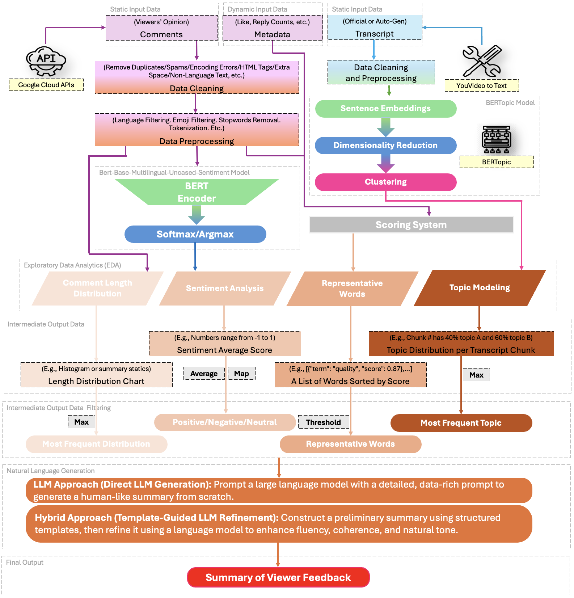
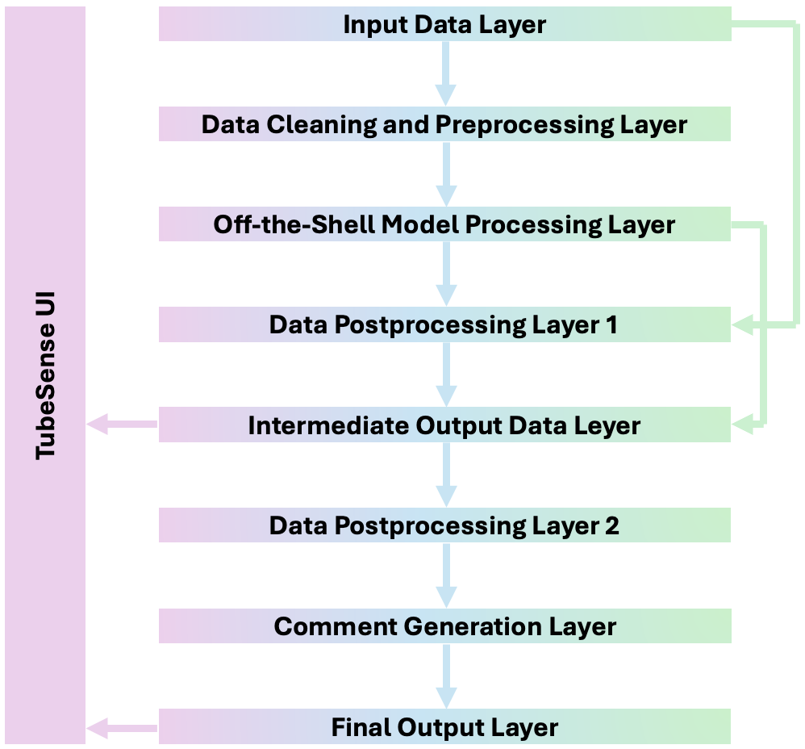

# TubeSense


TubeSense is a Python-based NLP analytics pipeline for exploring how YouTube viewers respond to a video. It collects or accepts YouTube comments, cleans comments and transcript text, runs exploratory language analysis, applies sentiment and topic models, and generates structured prompts or template summaries that can be used for audience-response reporting.

> The repository is organized as a reproducible research/notebook workflow. It includes preprocessing scripts, Jupyter notebooks, bundled sample data, precomputed analysis artifacts, and architecture diagrams.

## Authors

[Chloe Xin DAI](https://github.com/PhDinTimeManagement) <br>
[Chase HUBBUCH](https://github.com/TortillaDaHut) <br>

## What TubeSense Does

TubeSense helps turn raw YouTube comments and transcript text into compact audience-insight signals:

- **Comment collection** from the YouTube Data API using a scraper notebook.
- **Comment preprocessing** with HTML removal, language filtering, whitespace normalization, and alphabetic-token filtering.
- **Transcript preprocessing** with metadata/disclaimer trimming, lowercasing, lemmatization, stop-word removal, and sentence-level cleaned output.
- **Comment length analysis** through distribution plots and frequency tables.
- **Representative-word extraction** using NLTK tokenization, POS filtering, lemmatization, stemming, and engagement-weighted scoring.
- **Sentiment analysis** using the Hugging Face model `nlptown/bert-base-multilingual-uncased-sentiment`.
- **Transcript topic modeling** using BERTopic with HDBSCAN clustering.
- **Natural-language generation support** by producing a GPT-ready prompt, a deterministic template summary, and a refinement prompt.
- **Optional summary evaluation** through `Evaluation.py`, which calls the OpenAI API after manual configuration.

TubeSense does **not** currently include a production web UI, a packaged Python module, automated orchestration, CI, or a deployed application.

## Pipeline Overview

### NLP Pipeline



### Layered Architecture



At a high level, the workflow is:

1. Collect or provide YouTube comments and a transcript.
2. Clean and normalize the raw text inputs.
3. Run exploratory comment analytics.
4. Run sentiment analysis on comments.
5. Run topic modeling on the cleaned transcript.
6. Convert analysis artifacts into compact intermediate outputs.
7. Generate a prompt or template summary focused on audience response.

## Repository Structure

```text
TubeSense
├── Evaluation.py
├── LICENSE
├── README.md
├── raw_data/
│   ├── comments.csv
│   └── transcript.txt
├── raw_data_collector/
│   └── YouTube_Comments_Scraper.ipynb
├── data_preprocessor/
│   ├── Comments_Preprocessor.py
│   └── Transcript_Preprocessor.py
├── data_preprocessed/
│   ├── comments_cleaned.csv
│   └── transcript_cleaned.txt
├── exploratory_data_analytics/
│   ├── comment_length_distribution/
│   │   ├── Comment_Length_Distribution.ipynb
│   │   └── CLD_res/
│   ├── representative_words/
│   │   ├── Representative_Words_Extractor.ipynb
│   │   └── RW_res/
│   ├── sentiment_analysis/
│   │   ├── Sentiment_Analyzer.ipynb
│   │   └── SA_res/
│   └── topic_modeling/
│       ├── BERTopic.ipynb
│       ├── bertopic_model.pkl
│       └── TM_res/
├── intermediate_output/
│   ├── from_CLD_res/
│   ├── from_RW_res/
│   ├── from_SA_res/
│   └── from_TM_res/
├── natural_language_generation/
│   └── nl_generator.py
└── media/
    ├── layered_archi.png
    └── nlp_pipeline.png
```

## Data and Generated Artifacts

The repository includes a bundled sample run. The major input and output files are:

| Path | Description |
| --- | --- |
| `raw_data/comments.csv` | Raw YouTube comments with `comment`, `num_of_likes`, and `reply_count` columns. |
| `raw_data/transcript.txt` | Raw transcript text with video metadata and disclaimer text. |
| `data_preprocessed/comments_cleaned.csv` | Cleaned English comments with like and reply metadata retained. |
| `data_preprocessed/transcript_cleaned.txt` | Cleaned transcript text, one processed sentence per line. |
| `exploratory_data_analytics/comment_length_distribution/CLD_res/` | Histogram images for comment-length ranges. |
| `exploratory_data_analytics/representative_words/RW_res/complete_words_ranking.csv` | Full representative-word ranking with engagement-weighted scores. |
| `exploratory_data_analytics/sentiment_analysis/SA_res/comments_with_sentiment.csv` | Comment-level sentiment labels from the Hugging Face sentiment model. |
| `exploratory_data_analytics/topic_modeling/bertopic_model.pkl` | Saved BERTopic model artifact. |
| `exploratory_data_analytics/topic_modeling/TM_res/topic_summary.csv` | BERTopic topic summary table. |
| `exploratory_data_analytics/topic_modeling/TM_res/topic_word_scores.png` | Topic word-score visualization. |
| `intermediate_output/from_CLD_res/comment_length_distribution.csv` | Comment-length frequency table used by the generation script. |
| `intermediate_output/from_RW_res/representative_words.csv` | Top 50 representative words. |
| `intermediate_output/from_TM_res/global_word_importance_from_BERTopic.png` | Word cloud of aggregated BERTopic word importance. |

For the bundled sample artifacts:

| Metric | Value |
| --- | ---: |
| Raw comments | 85,800 |
| Cleaned comments | 26,789 |
| Cleaned transcript length | 1,255 words |
| Maximum cleaned comment length | 94 words |
| Most common cleaned comment length | 3 words |
| Sentiment distribution used by `nl_generator.py` | 64.0% positive, 11.0% neutral, 25.0% negative |
| Average cleaned comment length | 6.6 words |

## Prerequisites

- Python 3.10 or 3.11 recommended.
- Jupyter Notebook or JupyterLab for running the analysis notebooks.
- A YouTube Data API key, only if collecting new comments.
- An OpenAI API key, only if using the optional `Evaluation.py` script.

No database is required.

## Installation

Create and activate a virtual environment from the repository root:

```bash
python -m venv .venv
source .venv/bin/activate
```

On Windows PowerShell:

```powershell
python -m venv .venv
.\.venv\Scripts\Activate.ps1
```

Install the Python dependencies used by the scripts and notebooks:

```bash
pip install --upgrade pip
pip install \
  pandas matplotlib beautifulsoup4 langdetect spacy nltk \
  transformers torch bertopic hdbscan wordcloud \
  google-api-python-client youtube-data-api openai jupyterlab
```

Install the spaCy English model required by `Transcript_Preprocessor.py`:

```bash
python -m spacy download en_core_web_sm
```

Install the NLTK resources used by the representative-word workflow:

```bash
python - <<'PY'
import nltk

for package in [
    "stopwords",
    "wordnet",
    "punkt",
    "averaged_perceptron_tagger",
]:
    nltk.download(package)
PY
```

The BERTopic notebook includes these version pins:

```bash
pip install numpy==1.24.4 scipy==1.10.1
```

Use those pinned versions if you need to reproduce or reload the included BERTopic artifact consistently.

## Configuration

### YouTube Data API

`raw_data_collector/YouTube_Comments_Scraper.ipynb` contains placeholders:

```python
DEVELOPER_KEY = "your_key_here"
VIDEO_ID = "video_id_here"
```

Replace those values before collecting new comments. A safer production-style approach is to read the API key from an environment variable instead of writing it into a notebook:

```bash
export YOUTUBE_API_KEY="your-api-key"
```

```python
import os

DEVELOPER_KEY = os.environ["YOUTUBE_API_KEY"]
VIDEO_ID = "your-video-id"
```

### OpenAI Evaluation

`Evaluation.py` is optional and is not part of the core analytics pipeline. It currently contains a placeholder API key assignment:

```python
openai.api_key = "your-api-key-here"
```

Do not commit a real API key. Use an environment variable or another secret-management method before running the evaluation script.

### Relative Paths

Most notebooks use relative paths such as `../../data_preprocessed/comments_cleaned.csv`. They are written as if the notebook kernel is running from the notebook's own directory. If paths fail, either change into the notebook directory before running it or update the relative paths in the notebook.

## Usage

You can run TubeSense with the bundled sample data or replace the input files with your own YouTube comments and transcript.

### 1. Collect YouTube Comments

Open the scraper notebook from its directory:

```bash
cd raw_data_collector
jupyter lab YouTube_Comments_Scraper.ipynb
```

Configure:

```python
DEVELOPER_KEY = "your_key_here"
VIDEO_ID = "video_id_here"
```

The notebook writes scraped comments to:

```text
raw_data/comments.csv
```

Expected CSV schema:

```text
comment,num_of_likes,reply_count
```

The scraper collects top-level comments, their like counts, and total reply counts through the YouTube Data API.

### 2. Add or Replace the Transcript

Place the target video's transcript at:

```text
raw_data/transcript.txt
```

The transcript preprocessor can remove simple metadata sections, bracketed text, HTML-like tags, and disclaimer text beginning with `disclaimer:`.

### 3. Preprocess Comments and Transcript

Run the preprocessing scripts from the repository root:

```bash
python data_preprocessor/Comments_Preprocessor.py \
  --input raw_data/comments.csv \
  --output data_preprocessed/comments_cleaned.csv

python data_preprocessor/Transcript_Preprocessor.py \
  --input raw_data/transcript.txt \
  --output data_preprocessed/transcript_cleaned.txt
```

`Comments_Preprocessor.py` writes a cleaned CSV with this schema:

```text
comment,num_of_likes,reply_count
```

`Transcript_Preprocessor.py` writes cleaned transcript text to:

```text
data_preprocessed/transcript_cleaned.txt
```

### 4. Run Exploratory Analytics

Run the notebooks below from their respective directories.

#### Comment Length Distribution

```bash
cd exploratory_data_analytics/comment_length_distribution
jupyter lab Comment_Length_Distribution.ipynb
```

This notebook reads cleaned comments and displays histogram plots for multiple comment-length ranges.

#### Representative Words

```bash
cd exploratory_data_analytics/representative_words
jupyter lab Representative_Words_Extractor.ipynb
```

This notebook writes:

```text
exploratory_data_analytics/representative_words/RW_res/complete_words_ranking.csv
```

Before running it on a different machine, remove or update this local path in the notebook:

```python
NLTK_DATA_PATH = "/Users/chloeyamtai/nltk_data"
```

#### Sentiment Analysis

```bash
cd exploratory_data_analytics/sentiment_analysis
jupyter lab Sentiment_Analyzer.ipynb
```

This notebook writes:

```text
exploratory_data_analytics/sentiment_analysis/SA_res/comments_with_sentiment.csv
```

The notebook sends the full cleaned comment list through the Hugging Face sentiment pipeline. For large datasets, consider batching comments to reduce memory pressure.

#### Topic Modeling

```bash
cd exploratory_data_analytics/topic_modeling
jupyter lab BERTopic.ipynb
```

This notebook reads the cleaned transcript, chunks it into 100-word documents, fits BERTopic with HDBSCAN, and writes:

```text
exploratory_data_analytics/topic_modeling/bertopic_model.pkl
exploratory_data_analytics/topic_modeling/TM_res/topic_summary.csv
```

### 5. Refresh Intermediate Outputs

The repository includes precomputed intermediate outputs. For a new dataset, regenerate them after rerunning the analytics notebooks.

#### Comment-Length Frequency Table

`natural_language_generation/nl_generator.py` expects:

```text
intermediate_output/from_CLD_res/comment_length_distribution.csv
```

The included comment-length notebook displays plots but does not explicitly export this CSV. To regenerate it from cleaned comments, run this from the repository root:

```bash
python - <<'PY'
import pandas as pd

comments = pd.read_csv("data_preprocessed/comments_cleaned.csv")
lengths = comments["comment"].astype(str).str.split().map(len)
counts = (
    lengths.value_counts()
    .reindex(range(1, int(lengths.max()) + 1), fill_value=0)
    .rename_axis("Length")
    .reset_index(name="Count")
)
counts.to_csv("intermediate_output/from_CLD_res/comment_length_distribution.csv", index=False)
PY
```

#### Top Representative Words

```bash
cd intermediate_output/from_RW_res
jupyter lab Representative_Words.ipynb
```

This notebook writes:

```text
intermediate_output/from_RW_res/representative_words.csv
```

#### Sentiment Summary

```bash
cd intermediate_output/from_SA_res
jupyter lab Sentiment_Summarizer.ipynb
```

This notebook computes the average star rating and a rounded qualitative sentiment category. It prints the result but does not write a separate output file.

#### BERTopic Word Importance

```bash
cd intermediate_output/from_TM_res
jupyter lab Frequent_Topics.ipynb
```

This notebook loads the saved BERTopic model and creates a global word-importance word cloud.

### 6. Generate a Prompt and Template Summary

Run the generation script from the repository root:

```bash
python natural_language_generation/nl_generator.py
```

The script loads the precomputed analytics outputs and prints:

- a GPT-ready prompt containing sentiment distribution, average comment length, top representative words, and dominant topics;
- a deterministic template-based summary;
- a refinement prompt that can be sent to an LLM.

The script does **not** call an LLM by default.

### 7. Optional Summary Evaluation

After configuring the OpenAI API key, run:

```bash
python Evaluation.py
```

`Evaluation.py` evaluates an example summary using four qualitative dimensions described in the prompt: clarity, coherence, relevance, and substance. Update the `test_sentence` variable before using it to evaluate real generated summaries.

## Methodology Details

### Comment Preprocessing

`data_preprocessor/Comments_Preprocessor.py` performs these steps:

1. Normalizes text encoding.
2. Removes HTML with BeautifulSoup.
3. Collapses repeated whitespace.
4. Detects language with `langdetect`.
5. Discards comments that are not detected as English.
6. Keeps alphabetic tokens only.
7. Preserves `num_of_likes` and `reply_count` metadata.

### Transcript Preprocessing

`data_preprocessor/Transcript_Preprocessor.py`:

1. Loads spaCy's `en_core_web_sm` model.
2. Removes HTML-like tags.
3. Removes bracketed text.
4. Lowercases the transcript.
5. Trims header text after a `---` separator when present.
6. Removes text beginning at `disclaimer:` when present.
7. Lemmatizes alphabetic non-stopword tokens.
8. Writes cleaned sentence lines to the output file.

### Representative-Word Scoring

`Representative_Words_Extractor.ipynb` extracts nouns and adjectives from cleaned comments. Each valid token is lowercased, lemmatized, stemmed, and accumulated into a global score.

The per-comment score is based on:

| Signal | Score contribution |
| --- | ---: |
| Base comment presence | `+1` |
| More than 1,000 likes | `+4` |
| More than 100 likes | `+3` |
| 100 or fewer likes | `+2` |
| At least one reply | `+2` |

### Sentiment Mapping

The sentiment notebook saves labels from `1 star` through `5 stars`. The generation script maps them as follows:

| Model label | Generated category |
| --- | --- |
| `1 star`, `2 stars` | Negative |
| `3 stars` | Neutral |
| `4 stars`, `5 stars` | Positive |

### Topic Modeling

`BERTopic.ipynb` chunks the cleaned transcript into 100-word documents and fits:

```python
HDBSCAN(min_cluster_size=2, min_samples=1)
BERTopic(hdbscan_model=hdbscan_model, nr_topics=None, low_memory=True)
```

It exports a pickled BERTopic model and topic summary CSV.

### Natural-Language Generation

`natural_language_generation/nl_generator.py` combines these analysis signals:

- positive, neutral, and negative sentiment percentages;
- average cleaned comment length;
- top representative words;
- top BERTopic topic representations.

It then prints a structured prompt and a template summary. This keeps deterministic analytics separate from LLM-based rewriting.
